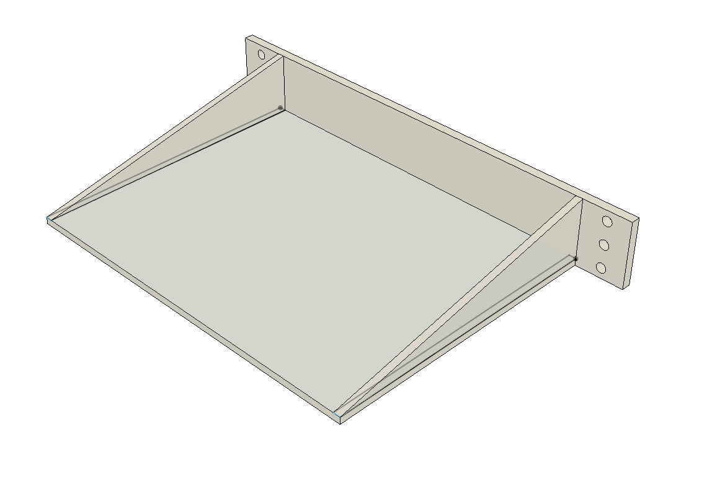

# JustRack

## Table of Contents

- [JustRack](#justrack)
  - [Table of Contents](#table-of-contents)
  - [About](#about)
    - [Credits](#credits)
  - [Software](#software)
  - [Hardware](#hardware)
    - [Store-bought](#store-bought)
    - [3D printed](#3d-printed)
      - [Recommended FDM print settings:](#recommended-fdm-print-settings)
    - [Tools](#tools)
  - [OpenSCAD scripts](#openscad-scripts)
    - [Mounting rail](#mounting-rail)
    - [Rack module](#rack-module)
    - [Side support](#side-support)
  - [Custom modules](#custom-modules)
    - [Design guidelines](#design-guidelines)
      - [Front plate example](#front-plate-example)
      - [Base plate](#base-plate)
    - [Available custom modules](#available-custom-modules)

## About

JustRack is a compact and modular enclosure for housing electronic modules.
This design allows for customization in terms of width, depth and length. Custom modules can be designed according to a couple simple design rules (see "Custom modules" section). This page assumes 200mm width and depth.

### Credits

This project was inspired by [6" Rack Enclosure, Customizable by KronBjorn](www.thingiverse.com/thing:1936196) on Thingiverse.

---

## Software

- OpenSCAD - for generating parametric models from the provided scripts.
- Fusion 360 (optional, personal choice) - custom modules design.

## Hardware

My main goal was to make the design as accesible as possible. That's why I chose V-Slot rails, as they are commonly available. T-Slot is also a possibility, but keep in mind that the included [OpenSCAD script for mounting rail generation](models/scad/mounting_rail.scad) is intented for V-Slot (I might add a T-Slot design in the future).

### Store-bought

| Part                                | Amount (pcs) | Note                            |
| :---------------------------------- | :----------- | :------------------------------ |
| OpenBuilds V-Slot 20x20 Linear Rail | 4            | Any length is fine              |
| M5 screw                            | 8            | Top and bottom frames           |
| M4 screw                            | As needed    | Module mounting, can be longer. |
| 10x3mm rubber feet                  | 4            | Can be higher than 3mm          |

- Socket head hex screws are a personal preference, other types of screw heads will also work. The benefit of using socket head hex screw is that the bottom of the head is flat, so they don't bite into the mounting rail surface. Shims might be used to adapt screws with other types of screw head.
- Longer module mounting screws (M4), may require placing a shim between the screw head and module front plate, to fill the excess space.

### 3D printed

| Part ID                                  | Amount (pcs) |
| :--------------------------------------- | :----------- |
| Bottom cover                             | 1            |
| Top cover                                | 1            |
| External sides mounting rails            | 8            |
| Internal sides mounting rails (optional) | 8            |
| M4 screw shims                           | As needed    |

#### Recommended FDM print settings:

- 0.2mm layer height
- 0.4mm nozzle

### Tools

- 3D printer with build plate of at least 20x20cm in size. Please take the potentially additional brim/skirt space into account.
- Screwdriver/hex keys.
- 5mm screw tap.

---

## OpenSCAD scripts

### Mounting rail

Designed for slots in V-Slot linear rails. Generated based on specified length (mm), which should be equal to the length of the chosen V-Slot rail.

### Rack module

Generates a generic rack module consisting of a front and base plate.

Customizable parameters:

- module height (units),
- front plate thickness (mm),
- base plate length (mm),
- base plate thickness (mm).

### Side support

Generates a part for supporting longer and/or heavier modules on the side that is opposite to their front panel. May be also used to mount miscallenous parts or routing cables.

## Custom modules

### Design guidelines

Requirements for custom module design:

| Constraint                         | Values                                       |
| ---------------------------------- | -------------------------------------------- |
| Front plate width                  | 200mm                                        |
| Front plate height                 | 10mm\*n - 1mm from top and bottom            |
| Front plate screwhole position     | Vertical spacing between hole centers = 10mm |
| Screw hole diameter                | Equal to bracket screw size + ~0.2mm         |
| Inner module width                 | <=158mm                                      |
| Module length (behind front plate) | 200mm                                        |

#### Front plate example

Height of this plate is 3 units - 0.6mm offsets from top and bottom sides. This is to avoid adjacent modules from colliding, as designing for 0mm spacing will cause trouble on mounting.

#### Base plate

Base plate should leave at least 1mm of empty space between itself and the V-Slot rails, to avoid excess friction and pressure.

Base plate extrusion should not exceed the rack's depth (200mm).

An optional, but recommended addition are reinforcements for the connection between front and base plate.

### Available custom modules

All the available custom modules with their descriptions are available in the [modules](modules) directory.

