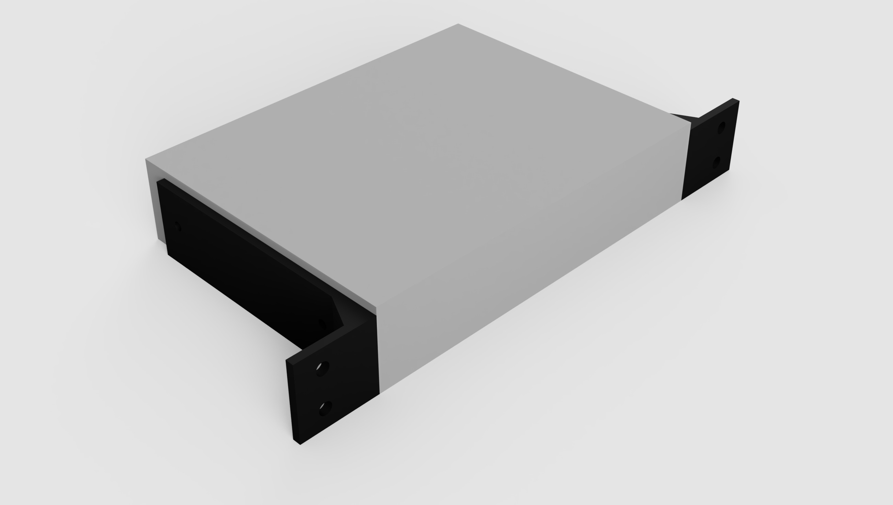

# D-Link DI-524 module

## About

This module requires drilling additional holes for 3mm mounting screws in the device's enclosure.

## Models

- [F3D](models/f3d)
- [STEP](models/step)
- [STL](models/stl)
