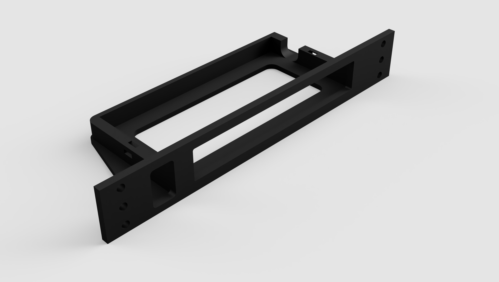

# Lanberg DSP1-1008 module

## About
After printing, the device should pop in place with some force. This might vary depending on the used 3d printer. In case the switch is loose inside the module, there are holes on the sides to hold it down with a zip tie.

## Models

- [F3D](models/f3d)
- [STEP](models/step)
- [STL](models/stl)
