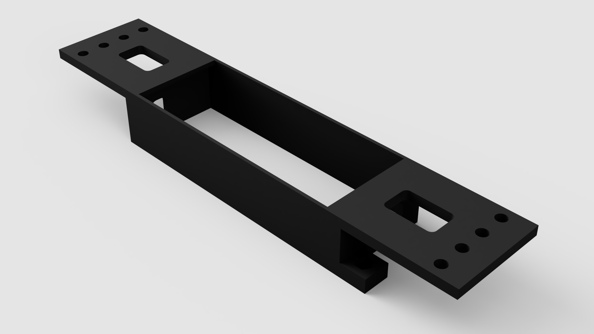

# Ports USB hub module

## About

This is a custom module for housing a [4-port USB hub by PORTS](images/ports_hub.jpg).

The back cover requires 2xM3 screws with nuts.

## Models

- [F3D](models/f3d)
- [STEP](models/step)
- [STL](models/stl)
