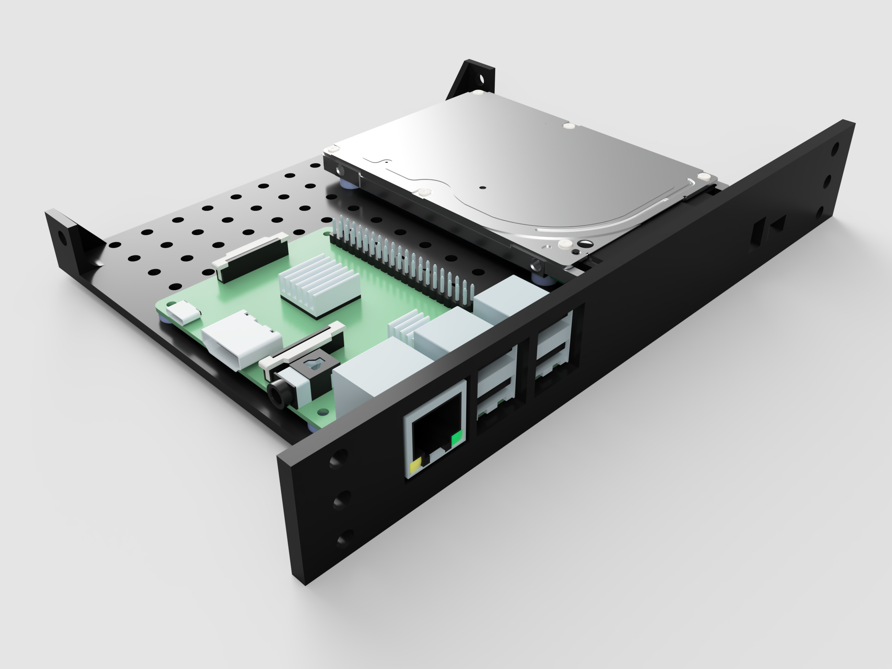

# Raspberry Pi 3B server module

## About

This is a custom module for housing a Raspberry Pi 3B and an external 2.5" HDD with a USB adapter. As this module is longer and heavier, it is recommended to use a side support on one side of the module.

## Models

- [F3D](models/module/f3d)
- [STEP](models/module/step)
- [STL](models/module/stl)
